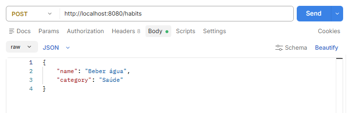
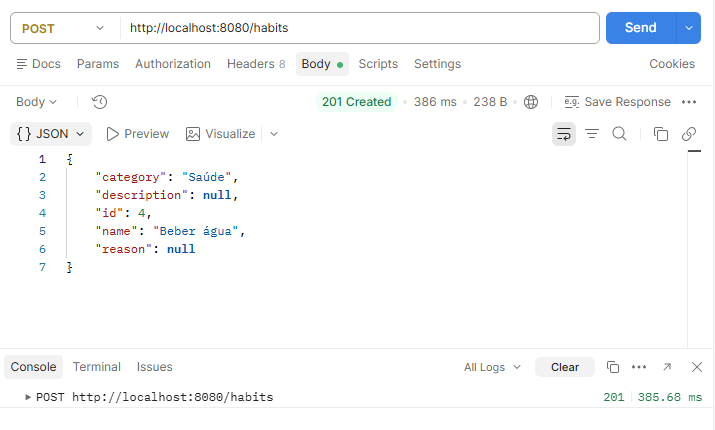
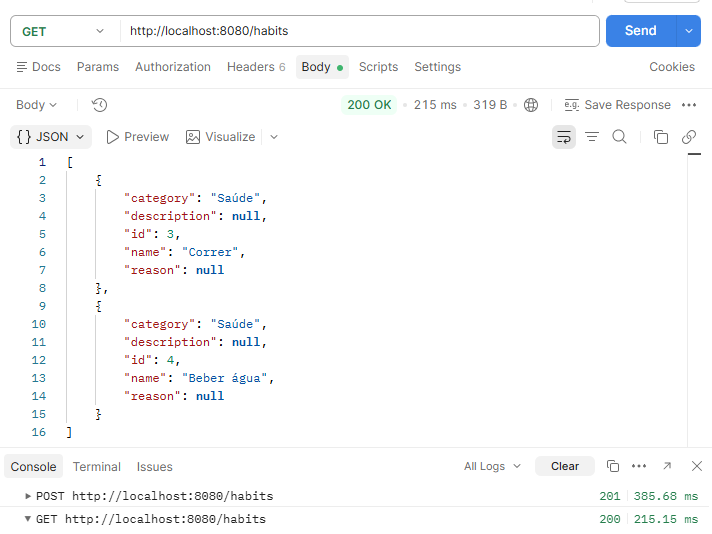
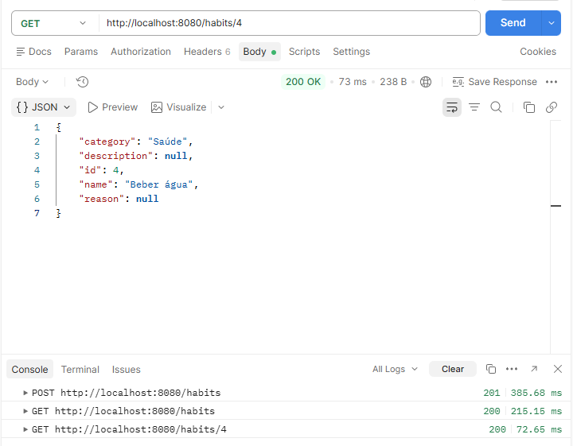
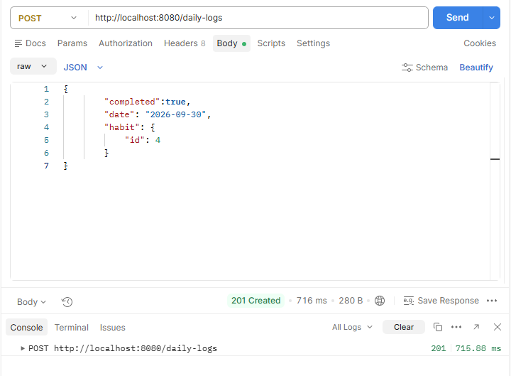
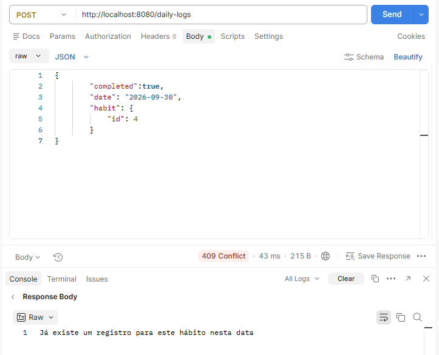
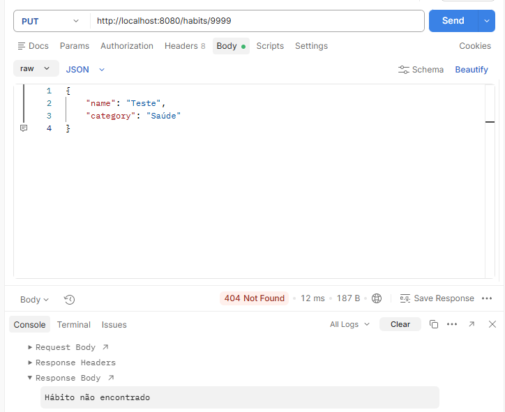

# Habit Tracker API

Realizar uma rotina organizada, visualizando progressos diários.

## Tecnologias

- Java
- PostgreSQL
- Spring Boot

## Funcionalidades

- Cadastro, edição e remoção de hábitos
- Registro diário de conclusão de hábitos, com edição e remoção
- Bloqueio de registros duplicados para o mesmo hábito na mesma data

## Próximos passos

- Desenvolver front-end em Angular para consumir a API

## Arquitetura

Projeto traz um modelo de arquitetura em camadas, realizando por partes, para que seja feita a conexão de forma correta. Sendo assim, tornando um API prática e organizada.

### Model

Define, em Java, a estrutura de cada entidade do sistema: seus campos, tipos e relacionamentos (como o @ManyToOne entre Habit e DailyLog). É a partir dessas classes, anotadas com @Entity, @Id e @JoinColumn, que o Hibernate mapeia os objetos Java às tabelas do banco de dados.

### Repository

Camada composta por interfaces que estendem JpaRepository, declarando os métodos de acesso ao banco de dados (como findAll, save e deleteById), sem exigir implementação manual. O Spring Data JPA gera automaticamente essa implementação em tempo de execução, utilizando o Hibernate para traduzir as chamadas em comandos SQL.

### Service

Camada que concentra as regras de negócio da aplicação, atuando como intermediária entre Controller e Repository. É nela que ficam implementadas validações específicas do domínio — como a checagem de existência de um hábito antes de uma atualização, e o bloqueio de registros duplicados para o mesmo hábito na mesma data. Quando uma regra é violada, o Service lança uma exceção, que é tratada pela camada de exceções antes de retornar ao Controller.

### Controller

Camada responsável por expor os endpoints REST e lidar cogm as requisições HTTP, implementando o CRUD completo (criação, leitura, atualização e remoção) para cada entidade. Recebe os dados da requisição, repassa ao Service para processamento e devolve a resposta ao cliente, com o código de status HTTP apropriado. Erros lançados pelo Service são interceptados pela camada de exceções (GlobalExceptionHandler), que os converte em respostas padronizadas (como 404 e 409), sem expor detalhes internos do sistema.

#
## Modelagem do banco de dados

**habit**
- id (PK)
- name
- category
- description
- reason

**daily_log**
- id (PK)
- date
- completed
- habit_id (FK → habit.id)

## Endpoints da API

### Habit

- GET /habits - lista todos os hábitos.
- GET /habits/{id} - busca hábito específico.
- POST /habits  - cria um novo hábito.
- PUT /habits/{id} - atualiza um hábito existente.
- DELETE /habits/{id} - deleta um hábito específico.

### DailyLog

- GET /daily-logs - lista todos os registros diários.
- GET /daily-logs/{id} - busca um registro específico.
- POST /daily-logs  - cria um novo registro.
- PUT /daily-logs/{id} - atualiza um registro existente.
- DELETE /daily-logs/{id} - deleta um registro.

## Como rodar o projeto

### Pré-requisitos

- Java (versão 17)
- Maven
- PostgreSQL

### Passos

1. Clone o repositório
2. Crie um banco de dados PostgreSQL chamado `habits_tracker`

   > **Obs:** caso prefira outro nome, altere a URL no `application.properties.example`, trocando `habits_tracker` pelo nome escolhido. Exemplo: `jdbc:postgresql://localhost:5432/nome_do_banco`

3. Copie o arquivo `application.properties.example` (em `src/main/resources`) e renomeie a cópia para `application.properties`
4. No novo arquivo, ajuste usuário e senha de acordo com sua configuração local do PostgreSQL
5. Execute o projeto com `./mvnw spring-boot:run`

## Testes

### Criando um hábito

### Listando hábitos

### Buscando um hábito específico

### Registrando a conclusão de um hábito

### Bloqueio de duplicidade

### Tratamento de recurso não encontrado

